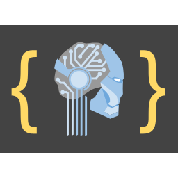

## AI Coder License

### Purpose
This credential certifies that a software developer has appropriate training and experience to safely use AI tools while writing code.

Coding with AI tools can be fast and productive. However, AIs may misunderstand requirements, hallucinate, suggest unwise dependencies, or provide code with subtle bugs, vulnerabilities, or IP problems. Embedding AIs in software triggers additional concerns. Developers who have an AI coder license are committed to and capable of managing these issues.

### Suggested visual
 
[svg](ai-coder.svg) | [800 px](ai-coder-800.png) | [256 px](ai-coder-256.png) | [64 px](ai-coder-64.png) | [32 px](ai-coder-32.png)

### Schema

The schema is in [`ai-coder.schema.json`](ai-coder.schema.json), its governance framework in [`rules.json`](rules.json), a SAID-verified instance in [`example.json`](example.json), and the chained form in [`examples/chained-to-coca.json`](examples/chained-to-coca.json). The [`invalid/`](invalid) directory holds the should-reject corpus.

The attribute block names both parties by AID and carries the licence window. `issuerName` and `issueeName` are conveniences for human readers: they are self-asserted, carry no verification weight, and the `namesAreConvenience` rule says a verifier that matches on a name rather than an AID has matched on nothing.

`validFrom` says when the licence begins conferring privileges, which may be before or after issuance. `validUntil` says when it stops — and after it, the issuer stops managing revocation, so an expired licence that has not been revoked is not thereby current. The `privilegesEndAtTheHorizon` rule makes that binding rather than advisory.

### Edges

The edges section is optional. It may carry an `issuer` edge, chaining to a credential that establishes who the issuer is (a vLEI credential is a good choice where one exists), and a `coca` edge, chaining to the issuee's [AI user code of conduct attestation](../ai-user-coca/index.md). The `coca` edge pins that schema's SAID as a `const`, which is why the two credentials are versioned together: re-minting one moves the other's constant.

An edge block's own `d` is optional, for the reason `a.d` is: the builder that issuers actually use emits no block SAID, so requiring one would reject every edge-bearing credential anyone could build.

### Governance framework

Three Ricardian clauses travel with every instance. `licenseNotGuarantee` says the issuer certifies the issuee met its criteria at issuance and guarantees no particular code, review or outcome — responsibility for what the issuee writes with an AI's help stays the issuee's. `namesAreConvenience` and `privilegesEndAtTheHorizon` carry the two points above.

Version 1.0.0 is preserved at [`ai-coder-1.0.0/`](../ai-coder-1.0.0) and stays resolvable under its original SAID.
