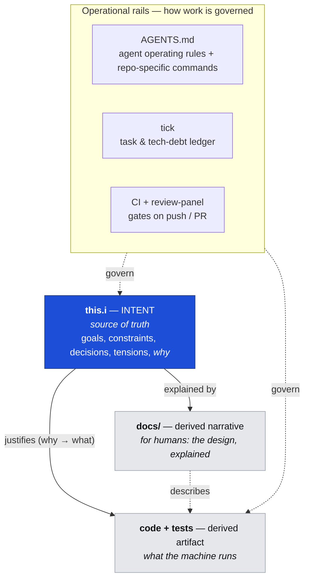

# Bakobo Development Methodology

**Status:** Living document. Update it alongside `this.i` when practice evolves.
**Applies to:** every non-trivial Bakobo repository created from this template.

Bakobo builds with an **intent-first, AI-assisted** methodology. The load-bearing idea is
simple: **the reasoning behind the software is a first-class, version-controlled artifact — not
something reconstructed from the code after the fact.** That artifact is [`this.i`](../this.i) at
the repository root. Code and prose are *derived* from it.

This brief is **operational** — it tells you how intent works *in a Bakobo repo*. The full theory
(marks, propagation, the reconciliation cycle, warnings overlays, the kind system) lives in the
canonical Intent Layer projects, which you may consult when you need depth:

- **[dhh1128/intent](https://github.com/dhh1128/intent)** — the Intent Layer format and rationale.
- **[dhh1128/ai-dev-practices](https://github.com/dhh1128/ai-dev-practices)** — org-level design
  principles for working with AI coding assistants.

> **For AI agents:** this document is authoritative for *how* to work here. The concrete commands
> for **your** repo (test runner, coverage tool, package manager) live in
> [`AGENTS.md`](../AGENTS.md) — this brief is deliberately language-neutral so one methodology
> serves every Bakobo repo. Where you see *"the test command"* below, read it from `AGENTS.md`.

---

## 0. The three layers

Everything in a Bakobo repo sits in one of three layers, with two operational rails around them:



- **`this.i`** is the **source of truth** for *intentions and the decisions that follow from
  them*. When intent and code disagree, the code is wrong (or `this.i` is stale and must be
  updated deliberately — never silently).
- **`docs/`** is a **derived, human-facing narrative** of the design. It explains `this.i` in
  prose for readers who want the story, not the tree. It never introduces a decision that isn't
  in `this.i`.
- **code + tests** are the **derived executable artifact**. Tests are the *primary specification*
  and the contemporaneous evidence that the author understood what they built.
- **The rails** — [`AGENTS.md`](../AGENTS.md) (operating rules + the repo's concrete commands),
  **`tick`** (task/tech-debt ledger), and **CI + [`review-panel`](#11-adversarial-review)** —
  govern how work moves from intent to merged code.

**The central rule:** *A decision not in `this.i` is not yet made.* It is implicit — which is
exactly what the intent layer exists to prevent.

---

## 1. What `this.i` is, and why every real repo has one

`this.i` is valid **YAML** at the repository root (larger projects may split into multiple `.i`
files — a *space*). It is a tree of **nodes**. Each node is a goal, a constraint, a decision, or a
recorded tension, and each carries a `why`.

Two problems justify the overhead:

- **The lacuna humana.** Source code expresses *instructions* but not the human context they serve
  — goals, tradeoffs, rejected alternatives, regulatory drivers. That context normally rots in
  comments, wikis, and people's heads. AI-generated code makes it worse: even the original
  developer's thought process is absent.
- **The comprehension illusion.** Developers (and AIs) who generate code without articulating
  rationale frequently *cannot demonstrate they understood it* when challenged later. A `why`
  written **at the moment of decision** is temporally-stamped proof of comprehension.
  Reconstruction after the fact — including AI-assisted reconstruction — is not equivalent.

### Node anatomy

The minimum valid node:

```yaml
Python with uv = decision:      # Name = [marks...] type:
  id: c4pw7x                     # opaque base32 [a-z2-7], 6–12 chars — NEVER a semantic label
  why: >
    imbu is written in Python and uv is the single tool for the virtualenv, install/locking,
    tests, and running the CLI. Chose Python because every reused component is Python; chose uv
    over pip+venv for speed, reproducible locking, and one command surface across dev/test/run.
```

- **The key line is `Name = [marks...] type:`.** Built-in types: `goal` (a desired outcome),
  `decision` (a choice between identified alternatives), `constraint` (an external limit), and
  `tension` (a recorded conflict). `deviation:` (§7) is a first-class type too.
- **`id:` must be opaque** — random base32 matching `^[a-z2-7]{6,12}$`. AIs habitually reach for
  meaningful labels (`auth-decision`, `python-choice`); **that is always wrong.** IDs survive
  renames: renaming a node changes only the YAML key, never the `id`, so `@id` references still
  resolve.
- **Optional common fields:** `children:` (nested nodes), `tensions:` (recorded conflicts),
  `stage-status:` (`planned` / `in-progress` / `done` — see below).
- **Marks** annotate nodes: `+mark` (affirmed, overridable), `++mark` (affirmed, **locked** — a
  descendant cannot contradict it without surfacing a tension), and their `-`/`--` negations.
  Use them sparingly and at the level of strategy, not implementation detail.

### Cold-start stance (read this before touching an unfamiliar `this.i`)

1. **The tree describes a *destination*, not just current state.** A node may describe planned
   work; the `stage-status:` field says which. Read it before assuming a node reflects code that
   exists.
2. **Tension resolutions are binding.** Implement consistently with them. Never silently re-resolve
   one; if new evidence warrants it, open a *new* tension referencing the old.
3. **`why` fields are primary evidence.** When you touch any node, its `why` is the most important
   thing to read — more than the name, more than the marks.
4. **`deviation:` nodes are the complete list of approved gaps** (§7). Any gap not represented by a
   `deviation:` node is a defect, not a judgment call.
5. **Before making any decision not already in `this.i`, record it there first** (§3, §5).

---

## 2. Starting `this.i` in a new repo

**Which repos get a `this.i`?** Every repo with genuine *design decisions* — services, libraries,
CLIs, the org model. **Trivial repos are exempt:** pure content/asset repos (brand assets, a static
docs site, a config-only repo) carry no design tension worth a tree, and a near-empty `this.i` is
noise. The threshold question: *"Will someone later need to know **why** this was built this way?"*
If yes, it needs `this.i`. If it's just *what*, it doesn't.

**How to seed one.** The Bakobo template ships a `this.i.seed` — an annotated one-node starter (an
adopted repo will already have consumed it). In a repo that warrants intent:

1. `cp this.i.seed this.i` (then delete `this.i.seed`).
2. Replace the root `goal:` node's name and `why` with **this repo's actual purpose** — the single
   outcome it exists to produce, written to the rebuttal-surface standard (§4).
3. Give it a fresh opaque `id` (any random `[a-z2-7]{6,12}` — do not reuse the seed's).
4. From then on, every consequential decision is recorded here **before** the code that implements
   it (§5), so the tree grows intent-first rather than being back-filled from code.

A repo that is exempt should simply **delete `this.i.seed`** — its absence is the signal that this
repo opted out, which is a fine and explicit state.

---

## 3. The `this.i` update trigger

"No decision without recording it first" is too vague to apply. Here is the concrete trigger.
**Any of these requires a node in `this.i` before the code change is pushed:**

- Any new public type or exported symbol (class, interface, enum, record, public function/module
  surface).
- Any new class/interface that embodies a behavioral invariant, even if non-public.
- Any new **external contract**: wire codes, DSL keywords, API surface, serialization format,
  CLI flags/output shape.
- Any **tension** identified between competing goals or constraints.
- Any deliberate decision *not* to do something obvious (a "why-not").
- Any **deviation** from a project standard — coverage, dependency rules, language version, test
  discipline. These become `deviation:` nodes (§7).
- Any rename of a significant type or concept.

If unsure, **err toward creating a node.** An unnecessary node costs little; an implicit decision
costs a great deal when someone who wasn't in the room must later reconstruct it.

---

## 4. The `why` field and the rebuttal-surface standard

The `why` is the most important field in every node. **A `why` is complete when a challenger can
identify specifically what they disagree with.**

| | Example |
|---|---|
| ✅ Meets standard | "Chose uv over pip+venv for speed, reproducible locking, and one command surface across dev/test/run." |
| ✅ Meets standard | "Chose a Bakobo fork of keripy over depending on upstream directly, so Bakobo controls when upstream instability is absorbed." |
| ❌ Fails (vague) | "Chose uv for developer experience." |
| ❌ Fails (standard practice) | "Standard approach for Python projects." |
| ❌ Fails (restates the name) | "Used Python with uv." |

**The test:** can a reviewer say *"I disagree because ___"?* If the `why` offers no surface for
that sentence to attach to, it has signaled that reasoning exists — not communicated it.

**Heuristic:** a `why` likely passes if it contains **a named rejected alternative**, **an explicit
tradeoff accepted**, or **a specific driving constraint** (named, not gestured at). None of the
three → probably vague.

The standard matters most for decisions that constrain future options, tension resolutions,
external contracts, and deviations. It matters least for choices no reasonable person would make
differently. Apply judgment.

---

## 5. The speculative interview

**Before any phase of implementation**, hold a speculative interview. Its purpose is **not** to
enumerate every choice for a vote — it is to surface the human's *intentions*, from which most
choices follow automatically.

**The right level of inquiry.** A good question is one whose answer collapses several design forks.
If you're about to ask *"should we do A or B?"*, stop and ask: *what intention, if I knew it, would
make A or B obvious?* — and ask **that** instead. Intent-level questions have a recognizable shape:
*"what is this optimizing for?"*, *"in failure cases, what should the system protect — state, user
attention, or simplicity?"*, *"across this boundary, which side owns the vocabulary?"*

**Steps:**

1. **Trace the whole implementation mentally** — every type, method, test. No code yet.
2. **Identify every consequential fork** — where different answers produce different architectures,
   APIs, or test strategies.
3. **Group forks by their underlying intent**; write the single intent-level question that resolves
   each cluster. The output is far fewer questions than forks.
4. **State your model of the human's intentions and ask for confirmation or correction.** This *is*
   the interview, not a preamble. Surface individual forks only where intent doesn't settle them.
5. **Record intentions in `this.i` first** — near the top as `goal:` / `constraint:` / stance
   `decision:` nodes — then record specific decisions as children whose `why` cites the parent. A
   `this.i` whose top is design choices instead of intentions is organized inside-out.
6. **Present the test plan for approval** before implementing.

**Names are proposals.** Surface any name you intend to introduce during the interview — the human
may have domain vocabulary that makes a better one obvious. A name that needs a comment to explain
what the thing *really is* is a design smell; change the name, not the comment. Consistency beats
cleverness.

### What a good interview turn looks like

> **Anti-pattern (fork-level):** "For `init`, should the home directory be `~/.imbu/<profile>/`
> or `$XDG_CONFIG_HOME/imbu/`? And should the passcode be prompted, generated, or read from env?
> And should we allow a default profile?"
>
> **Better (intent-level):** "A home holds private key material *and* its authority state, and
> personas/automation are first-class tenants that can't answer a prompt. If I'm right that a home
> must stay one movable, backup-able unit and that no tenant is ever implicit, then the path
> convention, the out-of-band passcode, and the no-default-profile rule all follow. Is that the
> intent?" — one confirmation collapses three forks, and the answer lands as parent `goal:` nodes
> the specific decisions then cite.

**Commit discipline (this is the enforcement mechanism).** The `this.i` commit that records a
decision **must be its own commit** and **must appear earlier in `git log`** than the code commit
it justifies. "Recorded before code" is not satisfied by an edit in the same commit as the code —
the commit boundary is the verifiable artifact. This ordering forces the interview to actually
happen (there's no code yet to retroactively justify) and makes a missing prior `this.i` commit a
*visible* defect at review time.

> **Real example (imbu history):**
> ```
> a8f27f0  Implement `imbu show` and `imbu list` (read slice)   ← code
> 46b6090  Record imbu show/list slice decisions in this.i       ← intent, committed first
> ```
> The intent commit (`46b6090`) precedes the code commit (`a8f27f0`). That ordering is the audit
> trail. Reverse it, or fold both into one commit, and the discipline is unverifiable.

**Proportionality.** Scale the interview to the change's blast radius. A new external API warrants
the full five steps; a private helper with no external surface may warrant none. The §3 trigger
list is a good proxy for "big enough to require the full interview."

---

## 6. TDD discipline

> **Read the tests. Run the tests. Make your change. Run the tests again.**

New code requires tests written **before or alongside** implementation — never after. The test plan
is approved in the speculative interview *before* implementation begins. The test suite is the
primary specification and the primary evidence of comprehension: **if the tests weren't written
first, the specification was never reviewed.**

- Run the repo's **test command** (see `AGENTS.md`) and prove it green before every check-in.
- **Coverage target is 100% branch coverage of new code**, enforced in CI. Any gap requires an
  approved `deviation:` node (§7) — coverage is never lowered silently.
- Always leave existing code **better tested than you found it.**

Do not leave raw `TODO`/`FIXME` in committed code — convert them to `tick` entries (§8).

---

## 7. Approved deviations (the `deviation:` node type)

Any deviation from a project standard — the coverage target, a no-runtime-dependencies rule, a
language version, test discipline — must be **approved by a human** and recorded as a `deviation:`
node. `deviation:` is a first-class node type, peer to `decision:`.

```yaml
Permission to skip branch X coverage = deviation:
  id: q7m2px          # opaque base32 — no semantic prefix, no sequential numbering
  deviates-from: b6r4kn   # opaque id of the standard's node
  scope: >
    Exactly what is exempted, narrowly. A reader must be able to tell whether new
    code falls inside or outside the exception without guessing.
  why: >
    Rebuttal-surface rationale (§4). A challenger must be able to name the point
    they disagree with. E.g. "Unreachable default arm of an exhaustive switch;
    the language requires a default it cannot remove."
  approved-by: <human>, <YYYY-MM-DD>
```

- **Placement:** the `deviation:` node lives as a child of the standard it relaxes; `deviates-from:`
  carries the standard's opaque id so the link survives moves and queries.
- **Discovery is by node type**, never a central list: `grep -nE '= \[?[^]]*\]?\s*deviation:' this.i`
  (or read every `deviation:` node). No numbering to keep in sync.
- **A gap without a `deviation:` node is a defect**, not a judgment call. An AI cannot unilaterally
  declare a gap acceptable; that requires explicit human approval and a recorded rationale.

> *Legacy note:* some older files use a `cd-N` convention. Migrate each to a `deviation:` node with
> a fresh opaque id, populate `deviates-from:`/`scope:`/`why:`/`approved-by:`, and leave a
> `# was: cd-N` comment on the name line.

---

## 8. Tech debt via `tick` (not an external tracker)

Bakobo tracks tasks, tech debt, and ideas in **`tick`** — a local, orphan-branch ledger driven by
the `tick` CLI (see the `tick` stanza in [`AGENTS.md`](../AGENTS.md)). **Do not use Jira or any
external API for this.** When you identify tech debt during development — a known shortcut, a
structural compromise, a workaround for an external constraint:

1. `tick add "<short title>"` — records the debt and prints a **mark** (`~` + a digit-first 4-char
   base32 id, e.g. `~4mz3`).
2. **Place the mark at the code location** of the debt, in a comment, so the next reader finds the
   recorded context: `# ~4mz3 — drop-in O(n²) join; fine at current N, revisit past ~1k rows`.
3. When the debt is paid off, `tick off <id>` and **delete the mark(s)** it reports.

| Condition | Action |
|---|---|
| Small/local cleanup | `tick add` + place mark |
| Cross-module impact | `tick add` + place mark (mandatory) |
| Performance/security risk | `tick add` + place mark (mandatory) |
| Blocks future work | `tick add` + place mark (mandatory) |

Before editing a file, grep it for existing marks and read them first
(`rg '~[2-7][a-z2-7]{3}\b' <file>` then `tick show <id>`): a mark means recorded context exists for
that spot. **Undocumented debt is more dangerous than documented debt** — the next developer
"fixes" it not knowing it was intentional.

Debt that also constitutes a *deviation from a project standard* additionally gets a `deviation:`
node (§7); `tick` is for tracked work, `deviation:` is for approved standard-gaps. Many debts are
only `tick` entries; some are both.

---

## 9. Gate approval and phase boundaries

A phase boundary is an explicit, named checkpoint. **Commits may happen freely; pushes to the
remote require gate approval.**

**Gate criteria (all must hold):**

1. The test command passes with no failures.
2. Coverage meets the 100%-branch target, or every gap has an approved `deviation:` node.
3. `this.i` has nodes for all changes since the last gate that meet the §3 trigger — each committed
   *before* its code commit (§5).
4. All new `why` fields meet the rebuttal-surface standard (§4).
5. All new names reviewed for clarity, consistency, and model accuracy (§5).
6. Any tech debt introduced/discovered is captured in `tick` with marks placed (§8).
7. **A human has explicitly approved.** The gate is requested, never implied by a green test run.
8. **The adversarial-review question has been asked and answered:** *"Is now an appropriate time
   for adversarial review?"* The AI recommends; the human decides. If yes, §11 completes and all
   findings are addressed before the gate closes.

**How to request a gate** — state, explicitly:

> "Requesting gate approval for **[phase]**. Tests: [pass, command]. CI: [result of `gh run list`,
> verified not assumed]. Coverage: [X%; deviations: …]. `this.i` nodes added: [ids + trigger for
> each], each committed before its code. `why` fields meet the standard. Names reviewed: […].
> Adversarial review recommended: [yes/no + one-line rationale]. Awaiting explicit approval."

Then wait. Gate approval is never assumed.

---

## 10. PR-level obligation

Any PR that introduces new public types, new external contracts, or new behavioral invariants
**must include the corresponding `this.i` nodes.** A PR is **incomplete** if either (a) the required
nodes are missing, or (b) the nodes are present but committed *with* or *after* the code they
justify. Both are defects, not style preferences.

**This is a reviewer responsibility as much as an author's.** Review `this.i` the way you review
tests. Ask: *"For every significant new abstraction or external contract here, is there a node with
an `id` and a `why` meeting the rebuttal-surface standard? Does `git log` show that node's commit
landing before the code commit that depends on it?"* This template's
[`copilot-review-gate`](../.github/workflows/copilot-review-gate.yml) enforces the review step
mechanically; the *content* judgment is still yours.

---

## 11. Adversarial review

At a phase gate (when the §9.8 question is answered "yes"), run a **structured adversarial review**:
independent AI critics in named roles, **each with a fresh context window that has not read the
author's reasoning** — otherwise the criticism is compromised. The objective is to find what the
author *missed*, not to confirm what the author found.

Bakobo runs this through the **`review-panel`** workflow, whose default personas are:

| Persona | Lens |
|---|---|
| **Security** | What environmental assumptions could be violated? What trust boundaries are crossed? What data is handled unsafely? |
| **DevOps** | Will this survive production? Are CI, deploy, and observability automated and version-controlled, or is there manual/untracked state? |
| **Testability** | What is structured so an entire category of tests is impossible or misleading? What ships undetected? |
| **Maintainability** | Given only this code, what would an unfamiliar developer misunderstand, break, or "clean up" without realizing why it exists? |

Add `architect`, `performance`, `compliance`, or `ux` personas when the change warrants (e.g. `ux`
only for user-facing surfaces). The panel reads source read-only and writes its reports to
`reviews/` (uncommitted).

**Handling findings:** ranked critical / significant / minor. A human must **accept, defer, or
rebut** each critical/significant finding. Accepted → fixed before the gate closes. Deferred →
a `tension:` node in `this.i` with a recorded deferral rationale. Rebutted → a tension *resolution*
in `this.i` whose `why` meets the rebuttal-surface standard.

Adversarial review is not always warranted — for a narrow-blast-radius change the human may decline
it. The point of the §9.8 question is to make that decision **explicit and recorded** rather than
silently skipped.

---

## Appendix: `this.i` quick reference

**Node key line:** `Name = [marks...] type:`

| Type | Meaning |
|---|---|
| `goal` | a desired outcome or quality |
| `decision` | a choice between identified alternatives |
| `constraint` | an external limit that bounds the design |
| `tension` | a recorded conflict (open if no `resolution`) |
| `deviation` | an approved gap from a project standard (§7) |

**Marks:** `+m` affirmed/overridable · `++m` affirmed/**locked** · `-m` denied/overridable ·
`--m` denied/locked. Contradicting a locked ancestor surfaces a tension (not a parse error).

**IDs:** random base32, `^[a-z2-7]{6,12}$`. Never meaningful labels. Survive renames.

**References:** `Name`, `@id`, or canonical compound `Name@id`. The `@id` is authoritative when
name and id disagree.

**`why` passes** if it names: a rejected alternative, an accepted tradeoff, **or** a specific
driving constraint.

**Trigger → node before push** (§3): new public type · new external contract · new invariant ·
tension · why-not · standard deviation · significant rename.

**Commit order (§5):** `this.i` node commit **before** the code commit it justifies; never bundled.

**Gate (§9):** tests green · coverage/deviations · `this.i` current · `why`s pass · names reviewed ·
`tick` current · human approval · adversarial-review question asked.
